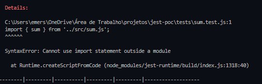
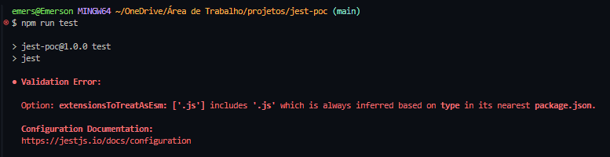

# jest-poc

Studies about jest and testing features

## Steps

- install Jest
  - `npm install --save-dev jest`


- create any function
  ```js
  function sum(a, b) {
    return a + b;
  }

  module.exports = sum; 
  ```

- create a file that ends with `.test.js`, ex.: `sum.test.js`
   ```js
    const sum = require('./sum');

    test('adds 1 + 2 to equal 3', () => {
      expect(sum(1, 2)).toBe(3);
    });
  ```

- add a script in `package.json` to run Jest tests
  ```json
  {
    "scripts": {
      "test": "jest"
    }
  }
  ```

- run `npm run test` and you will see the results

## Problems

Using node v22.17.1



To use ESModules in test files, I had to install Babel with its presets.
https://jestjs.io/docs/getting-started#using-babel



When I've tried to handle this error with this solution: `extensionsToTreatAsEsm: ['.js']` in `jest.config.js`, I got the error above.

Put just `type: "module"` in `package.json` file did not work for me.
Probably there is some another configuration that you don't need to install babel, maybe with `jest.config.js`.